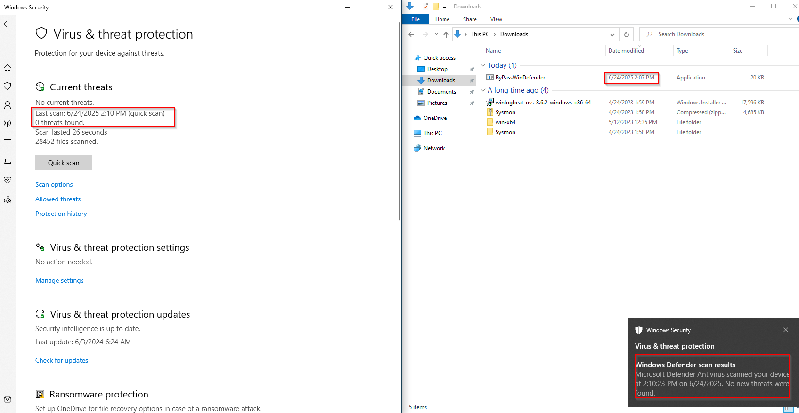

### Introduction
---

So I don't know why, but i've done some malware analysis (still a noob btw), i've also tried some malware development(still a noob btw) in an environment 
where windows defender was always disabled and i've never tried bypassing it. So I decided to start with something simple.
I started with a simple google search...How to bypass windows defender and i stumbled on 2 blog post, one was related to Loki C2 and the 
other with injecting shellcode inside a process that already had READ,WRITE AND EXECUTE memory sections.

And before you say it, yes, i know, it's already a known fact, it's easy to bypass windows...but to do it yourself is still learning. It's one thing
to just take a working code and just run it, but it's another thing to take the code understand it and modify it to the way you like.
That's why i learned reverse engineering, because you need to be able to understand the inner workings of anything you touch. I think
that's what make the difference between people in this field!

I guess you already know which one I chose to start with, I chose the latter.
Here's the blog I used as a reference : https://medium.com/@s12deff/bypass-windows-defender-executing-shellcode-using-freeloaderinjector-7deeba8796e2.
In that blog he used the undocumented API : `ntdll.dll`. I didn't want to just copy and paste it, so i adapted it by using the documented API
and I removed unnecessary stuff, which provided me a good practice and refresher.

[EDITED] You can read my blog post about how failed miserably, [here](https://8erg.github.io/posts/2025-07-10-injecting-shellcode-via-rwx-protected-memory-regions/)

### Setup
---

- Kali VM
- Windows 10 VM
- Visual Studio
- Metasploit
- Your Head
- ChatGPT (for reference of course😆)

## 3. Development
---

1. Enumerating the processes
2. If we're able to open the process, we'll have query inside it's memory to find a memory section with RWX
3. Once we find it we will decrypt and inject the shellcode inside that memory region and then start a thread starting from that section
4. We should get a reverse shell connection back to our `Slvier C2` if everything went well (sadly we don't😢)

### Conclusion
---

I think, that next i want to either try a dll sideloading, but first i'll probably try syswhisperers and then move on to using Loki with electron apps that also uses dll sideloading attacks, there's a good write-up on it [here](https://www.ibm.com/think/x-force/bypassing-windows-defender-application-control-loki-c2), if you want to take a head start!

